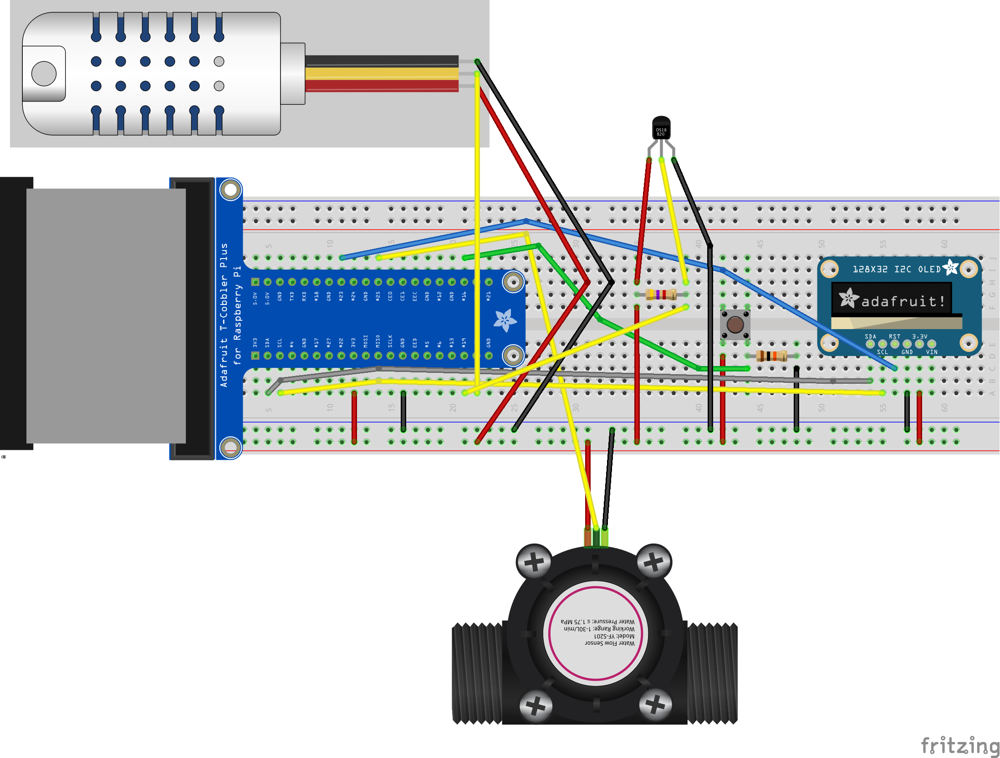

# Danger Brewing: Hub
The sensor hub for a NodeBot kegerator.

# Parts Required
more detailed parts list coming soon.

* [Raspberry Pi 3](https://www.adafruit.com/products/3055)
* [Cobbler](https://www.adafruit.com/products/2028)
* [5v Power Supply](https://www.adafruit.com/product/1995)
* [MicroSD](https://www.adafruit.com/products/2693)
* [Monochrome 128x32 OLED](https://www.adafruit.com/products/931)
* [Tactile Button](https://www.adafruit.com/products/367)
* [10K Ohm Resistor](https://www.adafruit.com/products/2784)
* [Flow Meter(s)](https://www.adafruit.com/products/828)
* OS - [Raspbian Jessie](https://www.raspberrypi.org/downloads/raspbian/)

# Setup
more detailed instructions coming soon.

* Setup raspberry pi
* install node
  * `cd /tmp`
  * `wget http://node-arm.herokuapp.com/node_latest_armhf.deb`
  * `sudo dpkg -i node_latest_armhf.deb`
* install and setup `git`
* clone repository
  * `npm install`
  * `npm run build`
  * `sudo node lib/index.js`

## Find i2c Address
`i2cdetect -y 1`

# Wiring Diagram

[diagram.fzz](assets/diagram.fzz)

# Building
* `npm run build`
* output is `lib/index.js`

# Resources
* [Johnny Five](http://johnny-five.io/)
* [Raspi-IO](https://github.com/nebrius/raspi-io)
* [oled-js](https://github.com/noopkat/oled-js)
* [Raspberry Pi Pin Information](https://github.com/nebrius/raspi-io/wiki/Pin-Information)
